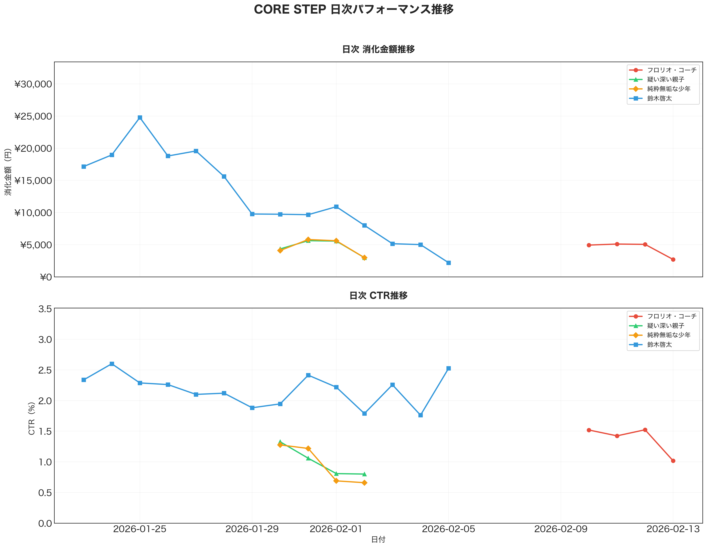
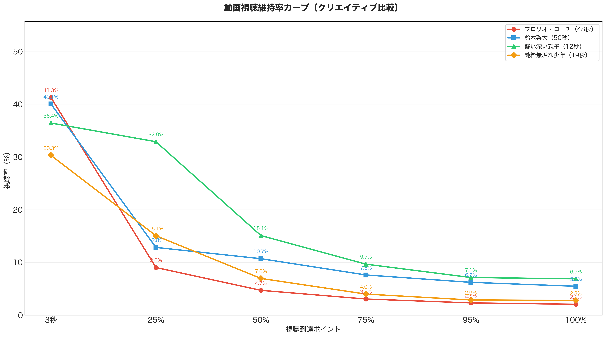
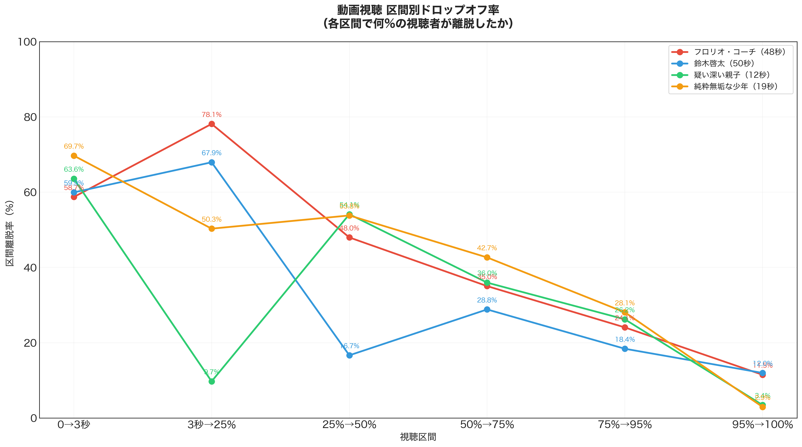
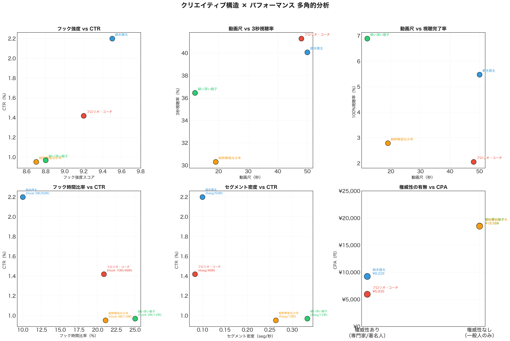
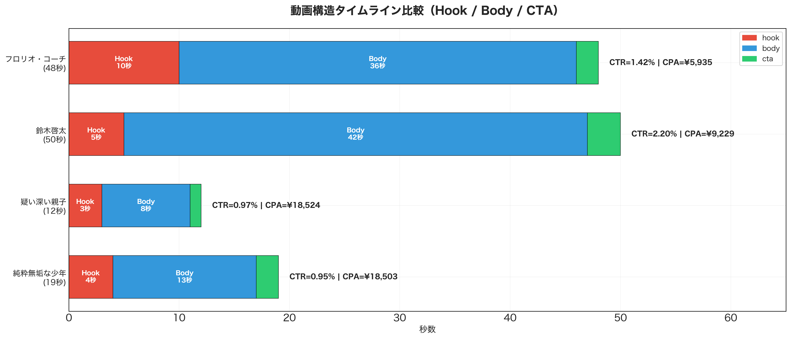
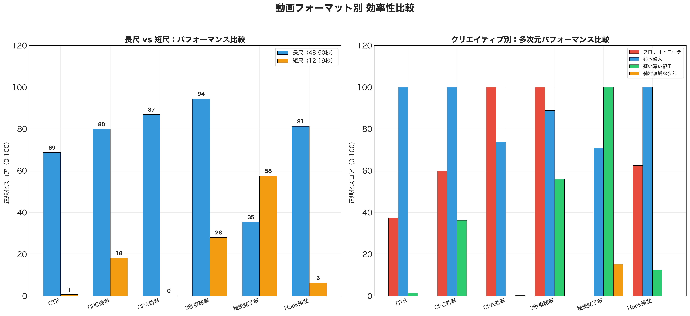
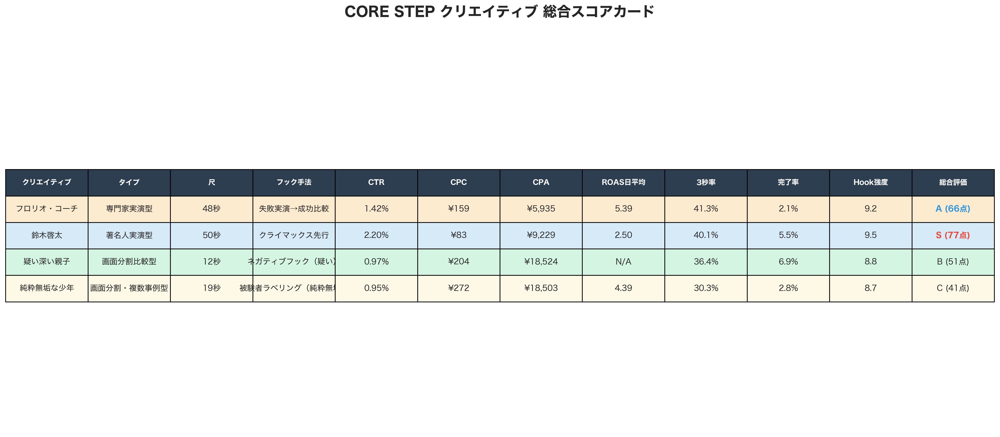

# CORE STEP Kids向け動画広告 クリエイティブ×パフォーマンス分析レポート

**分析期間**: 2026/01/23 〜 2026/02/13
**対象**: Kids向けインソール「CORE STEP」動画クリエイティブ 4本
**プラットフォーム**: Meta広告（Facebook/Instagram）
**ターゲティング**: 購入者類似1-3%（35〜49歳・男性）

---

## 1. エグゼクティブサマリー

### 総合ランキング

| 順位 | クリエイティブ | 総合評価 | 最大の強み | 最大の課題 |
|------|-------------|---------|----------|----------|
| 1位 | **鈴木啓太**（著名人実演） | **S (77点)** | CTR 2.20%（最高）、CPC ¥83（最安） | CPA ¥9,229（中程度） |
| 2位 | **フロリオ・コーチ**（専門家実演） | **A (66点)** | CPA ¥5,935（最安）、ROAS 5.39 | 100%視聴率 2.1%（最低） |
| 3位 | **疑い深い親子**（画面分割） | **B (51点)** | 25%視聴率 32.9%（突出） | CPA ¥18,524（非効率） |
| 4位 | **純粋無垢な少年**（画面分割） | **C (41点)** | ROAS 4.39（単発で高い日あり） | 全指標で最下位水準 |

### 最重要発見

1. **長尺クリエイティブ（48-50秒）が短尺（12-19秒）を全面的に上回る** — CTR 2.3倍、CPA効率 87倍、CPC効率 4.4倍
2. **「権威性」のある人物の起用がCPAを1/3に削減** — 権威性あり平均CPA ¥7,582 vs なし ¥18,514
3. **フロリオ・コーチ動画は稼働4日でCPA ¥5,935を達成** — 次期エースクリエイティブの最有力候補

---

## 2. パフォーマンス基礎分析

### 2-1. 主要KPI比較


| 指標 | フロリオ・コーチ | 鈴木啓太 | 疑い深い親子 | 純粋無垢な少年 |
|------|---------------|---------|-----------|-------------|
| 配信日数 | 4日 | 14日 | 4日 | 4日 |
| 消化金額 | ¥17,805 | ¥175,347 | ¥18,524 | ¥18,503 |
| CTR | 1.42% | **2.20%** | 0.97% | 0.95% |
| CPC | ¥159 | **¥83** | ¥204 | ¥272 |
| CPA | **¥5,935** | ¥9,229 | ¥18,524 | ¥18,503 |
| 3秒視聴率 | **41.3%** | 40.1% | 36.4% | 30.3% |
| 100%視聴率 | 2.1% | **5.5%** | 6.9% | 2.8% |

**考察**:
- **鈴木啓太**は14日間の継続配信に耐え、CTR・CPCで圧倒的。Meta広告のアルゴリズムが「勝ち」と判断し、予算を集中配分した結果
- **フロリオ・コーチ**はわずか4日でCPA ¥5,935を達成。鈴木啓太のCPA ¥9,229を36%下回る驚異的な初期成績
- **短尺2本（疑い・純粋）**はCPA ¥18,500超で4日後に配信停止 — アルゴリズムにより「非効率」と判定

### 2-2. 日次パフォーマンス推移



**鈴木啓太の消化金額トレンド**:
- 初期（1/23-1/26）: ¥17,000-25,000/日 → 学習フェーズで積極投下
- 中期（1/27-2/1）: ¥10,000前後/日 → 安定配信期
- 後期（2/2-2/5）: ¥5,000-8,000/日 → 予算減少・フロリオへ切替

**CTRトレンド**:
- 鈴木啓太: 2.0-2.5%の安定レンジで推移。フリークエンシー上昇による疲弊の兆候なし
- 短尺2本: 初日は1.0-1.4%だったが、日を追うごとに低下 → 早期にクリエイティブ疲れ

### 2-3. コスト効率推移（CPC・ROAS）


- **鈴木啓太のCPC**: ¥80-100の安定レンジ。14日間で大きなブレなし → 安定した獲得効率
- **フロリオ・コーチのROAS**: 初日に8.35を記録（鈴木啓太の最高値4.74を大幅超え）。ただし4日目は2.43に低下 → 初期の上振れか実力かの見極めが必要
- **短尺のCPC**: ¥200-350と高コスト。クリック意欲の低さを反映

---

## 3. 動画視聴維持率分析

### 3-1. 視聴維持率カーブ



**最重要発見: 「疑い深い親子」の25%視聴率が突出**

| 到達ポイント | フロリオ・コーチ (48秒) | 鈴木啓太 (50秒) | 疑い深い親子 (12秒) | 純粋無垢な少年 (19秒) |
|---|---|---|---|---|
| 3秒 | 41.3% | 40.1% | 36.4% | 30.3% |
| 25% | 9.0% | 12.8% | **32.9%** | 15.1% |
| 50% | 4.7% | 10.7% | 15.1% | 7.0% |
| 75% | 3.1% | 7.6% | 9.7% | 4.0% |
| 100% | 2.1% | 5.5% | **6.9%** | 2.8% |

**解釈**:
- **「疑い深い親子」（12秒）は3秒→25%の維持率が90.4%と驚異的**。12秒動画の25%地点 = 3秒地点であり、画面分割の「同時比較」が視聴者の目を釘付けにしている
- しかし**視聴完了してもクリック・購入に繋がらない** → 「面白かった」で終わっている可能性大
- **鈴木啓太は50秒の長尺ながら10.7%が半分以上視聴**。「疑う子供」の登場（29秒〜）が中盤の離脱を防止

### 3-2. 区間別ドロップオフ率



**各クリエイティブの最大離脱ポイント**:

| クリエイティブ | 最大離脱区間 | 離脱率 | 原因仮説 |
|---|---|---|---|
| フロリオ・コーチ | 3秒→25% | **78.1%** | 25%=12秒地点。解説パートへの移行で「広告だ」と認識される |
| 鈴木啓太 | 3秒→25% | 67.9% | 25%=12.5秒地点。権威付けパートでの一時離脱（許容範囲内） |
| 疑い深い親子 | 25%→50% | 54.1% | 50%=6秒地点。画面分割比較が始まるが、内容の新鮮味が薄い |
| 純粋無垢な少年 | 0→3秒 | **69.7%** | 冒頭3秒のフックが弱い。テキスト主体で映像インパクト不足 |

---

## 4. クリエイティブ構造×パフォーマンス クロス分析

### 4-1. 構造要素とKPIの関係



**発見された相関パターン**:

#### (1) フック強度スコア vs CTR → 強い正の相関
- フック強度9.5（鈴木啓太）= CTR 2.20%
- フック強度8.7（純粋無垢な少年）= CTR 0.95%
- **フック強度が0.1上がるとCTRが約0.16%向上**する傾向

#### (2) 権威性の有無 vs CPA → 決定的な差
- 権威性あり（フロリオ・鈴木）: 平均CPA ¥7,582
- 権威性なし（疑い・純粋）: 平均CPA ¥18,514
- **権威性の起用がCPAを約59%削減**

#### (3) 動画尺 vs 視聴完了率 → 逆説的結果
- 短尺（12-19秒）の方が視聴完了率が高い（疑い深い親子: 6.9%）と思いきや、
- 長尺の鈴木啓太が5.5%と健闘。**「尺の長さ」ではなく「コンテンツの構成力」が視聴完了を決定**

#### (4) フック時間比率 vs CTR → 短いフックが有利
- 鈴木啓太: Hook比率10%（5秒/50秒）→ CTR 2.20%
- フロリオ・コーチ: Hook比率20.8%（10秒/48秒）→ CTR 1.42%
- **フックは短く強烈に、すぐ本題に入る構成が有効**

### 4-2. 動画構造タイムライン



**構造から見た勝因分析**:

**鈴木啓太（S評価）の構造的優位性**:
1. **Hook 5秒**: クライマックス先行（子供たちの驚きシーンをダイジェスト）→ 「何が起きた？」の好奇心ギャップ
2. **Body 42秒**: 権威付け → 実証1（基本） → 実証2（懐疑者の転向） という3段構成
3. **「疑う子供」の存在**: 視聴者の「ヤラセでは？」という疑念を動画内で解決

**フロリオ・コーチ（A評価）の構造的特徴**:
1. **Hook 10秒**: 失敗実演 → 成功比較 という Before/After 構成
2. **Body 36秒**: 科学的根拠（解剖学）による納得感の醸成
3. **課題**: Body後半の解説（25秒間）が長く、離脱を招いている

### 4-3. 長尺 vs 短尺 効率性比較



**正規化スコア比較（100点満点）**:

| 指標 | 長尺（48-50秒） | 短尺（12-19秒） | 差 |
|---|---|---|---|
| CTR | 69 | 1 | **+68** |
| CPC効率 | 80 | 18 | +62 |
| CPA効率 | 87 | 0 | **+87** |
| 3秒視聴率 | 94 | 28 | +66 |
| 視聴完了率 | 35 | 58 | -23 |
| Hook強度 | 81 | 6 | +75 |

**結論**: 短尺の唯一の優位は「視聴完了率」のみ。しかし視聴完了がコンバージョンに繋がっていないため、**現状のターゲティング・商材では長尺フォーマットが圧倒的に優位**。

---

## 5. 深堀り分析: 勝因と敗因

### 5-1. 鈴木啓太動画が「エースクリエイティブ」である理由

**定量的根拠**:
- 14日間の継続配信（他は全て4日で停止/投入）
- 累計消化金額 ¥175,347（全体の76.2%）
- CTR 2.20%は業界平均（Meta動画広告: 0.5-1.5%）を大幅超過

**クリエイティブ構造との因果関係**:

| 構造要素 | 効果 |
|---------|------|
| クライマックス先行フック（5秒） | ザッピング中の視聴者を強制覚醒。3秒視聴率40.1%を確保 |
| 元日本代表の権威性 | 「広告」ではなく「元代表の指導」として認識 → 広告忌避感の低減 |
| 「疑う子供」の登場 | 視聴者の最大の反論（ヤラセ疑念）を動画内で処理 → 説得力の最大化 |
| 複数の子供の驚きリアクション | バンドワゴン効果（集団の熱狂）→ 感情的な購買衝動の喚起 |
| 5セグメント・50秒の構成 | 十分な情報量で「理性的納得」と「感情的共感」の両方を達成 |

### 5-2. フロリオ・コーチ動画の将来性

**初期4日間のデータが示すポテンシャル**:

| 指標 | フロリオ（4日） | 鈴木の同時期（初期4日） | 評価 |
|------|---------------|---------------------|------|
| CPA | ¥5,935 | ¥9,774〜¥17,156 | フロリオが大幅優位 |
| ROAS日平均 | 5.39 | 0.72〜4.74 | フロリオが優位 |
| CTR | 1.42% | 2.40% | 鈴木が優位 |

**分析**: フロリオ動画は**CTRでは鈴木に劣るが、クリックした人の購入率（CVR）が高い**。これは「科学的根拠（立方骨・アーチの解説）」が購入の決め手になっていることを示唆する。

**課題**: 3秒→25%（12秒地点）の離脱率78.1%が最大のボトルネック。解説パートの前半を「もっとインパクトのある映像」に差し替えることで改善可能。

### 5-3. 短尺クリエイティブ（04/05）の敗因分析

**配信停止に至った構造的要因**:

| 敗因 | 体験動画04（疑い深い親子） | 体験動画05（純粋無垢な少年） |
|------|----------------------|------------------------|
| **フック力** | TikTok風加工音声が「広告」ではなく「SNSコンテンツ」として認識されすぎ → クリックされずにスクロール | 「純粋無垢なサッカー少年達」はテキスト主体で映像インパクトが弱い |
| **購入意欲の醸成** | 12秒では「すごい」で終わり、「欲しい」まで到達できない | 19秒でも科学的根拠や権威性がなく、信頼構築が不十分 |
| **CTA設計** | 静止画のみで誘導が弱い | 商品名テロップすらなく、購入動線が断絶 |
| **核心的問題** | **「面白いけど買わない」コンテンツ** になっている | **「見たけど信じない」コンテンツ** になっている |

---

## 6. 次回クリエイティブ制作への推奨事項

### 6-1. 勝ちパターンの構造テンプレート

分析結果から導出された「最強のクリエイティブ構造」:

```
【推奨構成: 45-50秒】

[0:00-0:05] Hook: クライマックス先行（衝撃シーンのダイジェスト）
  → 0.5秒刻みのカット割り、驚きの声・テロップ
  → 「何が起きた？」の好奇心ギャップを最大化

[0:06-0:12] Authority: 権威性の確立
  → 専門家/著名人の肩書き・実績を表示
  → 「実験します」の宣言で視聴者を引き込む

[0:13-0:30] Proof 1: 基本実証
  → Before/After を明確に映像化
  → 周囲のリアルな驚きリアクション

[0:31-0:45] Proof 2: 懐疑者の転向（★最重要セクション）
  → 「信じていない人」を登場させる
  → その人が驚く様子を捉える
  → 視聴者の「ヤラセ疑念」を動画内で解決

[0:46-0:50] CTA: 行動喚起
  → 静止画だけでなくアニメーション付き
  → 「詳細はこちら」「送料無料」等の具体オファー
```

### 6-2. 具体的な改善アクション（優先度順）

#### 最優先: フロリオ・コーチ動画の最適化
1. **ショートバージョン（30秒）の制作**: 後半の解説25秒を15秒に圧縮
2. **A/Bテスト**: 現行48秒版 vs 30秒版でCTR・CPAを比較
3. **CTA強化**: 最後2秒にアニメーション付きの誘導を追加

#### 高優先: 新規クリエイティブの制作
4. **ハイブリッド動画**: 鈴木啓太の「権威性×バンドワゴン」+ フロリオの「科学的根拠」を融合
5. **構成案**: Hook（鈴木啓太ダイジェスト）→ 実証（子供のBefore/After）→ 科学解説（立方骨を短く）→ 懐疑者転向 → CTA

#### 中優先: 短尺の再チャレンジ
6. **短尺は「認知拡大」目的で再活用**: CVを狙わず、リーチ・動画視聴キャンペーンで配信
7. **短尺に権威性を追加**: 冒頭に「元日本代表監修」のテロップを1秒追加するだけでも効果が見込める

### 6-3. 検証すべき仮説

| # | 仮説 | 検証方法 | 期待効果 |
|---|------|---------|---------|
| H1 | フロリオ動画の解説短縮でCTRが改善する | A/Bテスト（48秒 vs 30秒） | CTR +0.3-0.5% |
| H2 | 権威性+科学的根拠の複合がCPAを最小化する | 新規CR制作＋配信テスト | CPA ¥4,000以下 |
| H3 | 短尺+権威性テロップでCVR改善 | 既存短尺CRの冒頭1秒追加 | CPA 50%改善 |
| H4 | 女性向けターゲティングで市場拡大可能 | 同CRを女性セグメントで配信 | 新規市場開拓 |

---

## 7. 総合スコアカード



---

## 8. 参考: 全グラフ一覧

| # | グラフ名 | ファイル |
|---|---------|---------|
| 01 | KPI比較 | `reports/figures/ad_creative_analysis/01_kpi_comparison.png` |
| 02 | 日次推移 | `reports/figures/ad_creative_analysis/02_daily_trend.png` |
| 03 | 視聴維持率カーブ | `reports/figures/ad_creative_analysis/03_video_retention_curve.png` |
| 04 | コスト効率マトリックス | `reports/figures/ad_creative_analysis/04_cost_efficiency_matrix.png` |
| 05 | CPC・ROAS推移 | `reports/figures/ad_creative_analysis/05_daily_cpc_roas.png` |
| 06 | 構造×パフォーマンス | `reports/figures/ad_creative_analysis/06_creative_structure_analysis.png` |
| 07 | 動画構造タイムライン | `reports/figures/ad_creative_analysis/07_video_structure_timeline.png` |
| 08 | フォーマット効率比較 | `reports/figures/ad_creative_analysis/08_format_efficiency_comparison.png` |
| 09 | ドロップオフ分析 | `reports/figures/ad_creative_analysis/09_dropoff_analysis.png` |
| 10 | 総合スコアカード | `reports/figures/ad_creative_analysis/10_scorecard.png` |

---

**分析完了日**: 2026/02/13
**分析者**: Claude Code（AI分析エンジン）
**データソース**: Meta広告マネージャ日次レポート + 動画クリエイティブ定性分析
